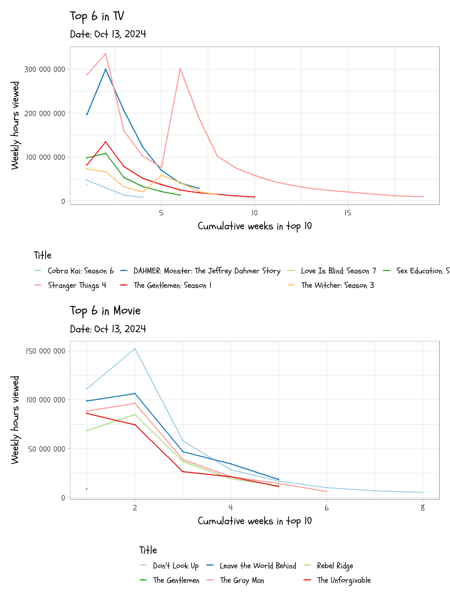
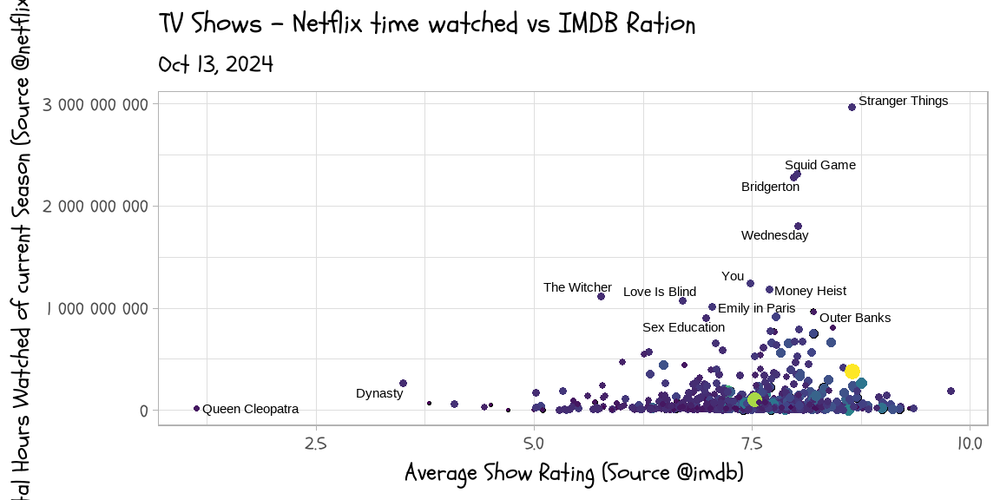
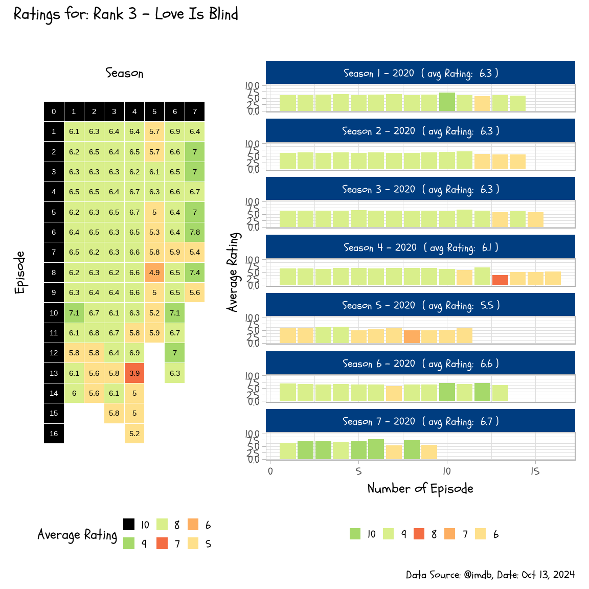
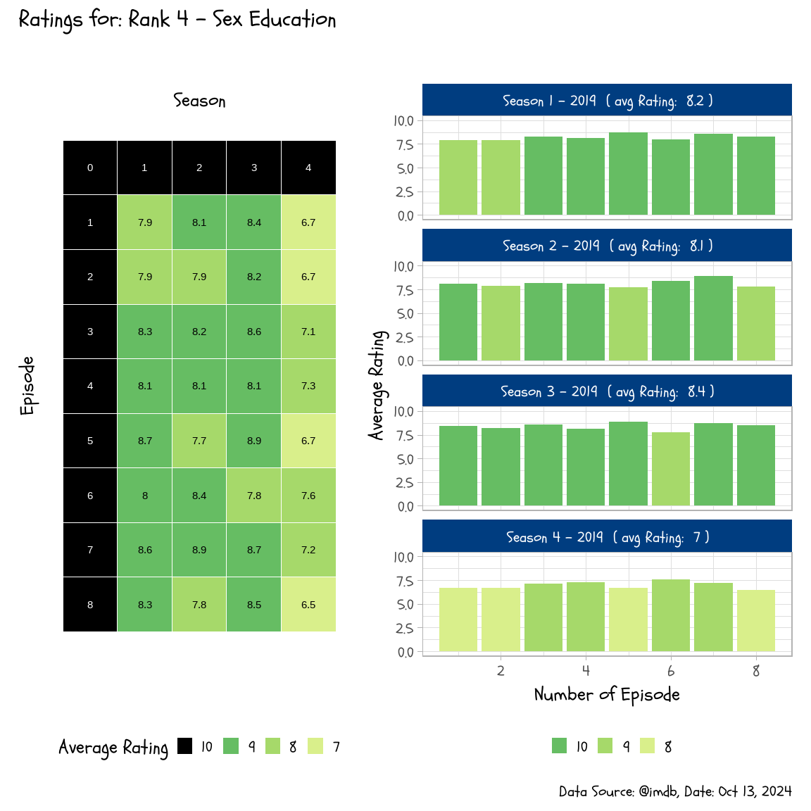
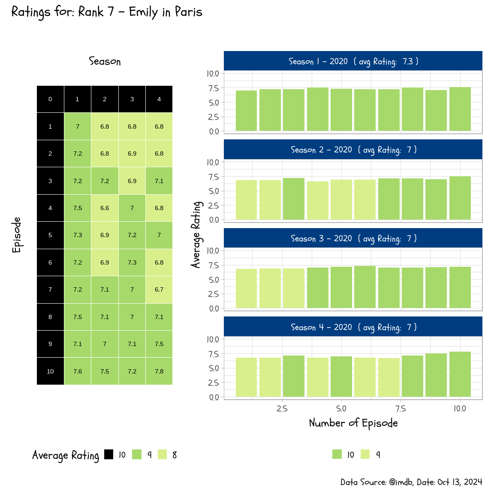
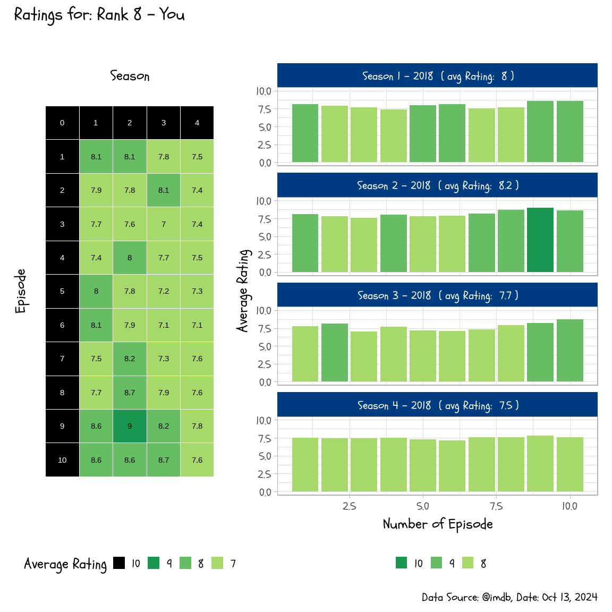
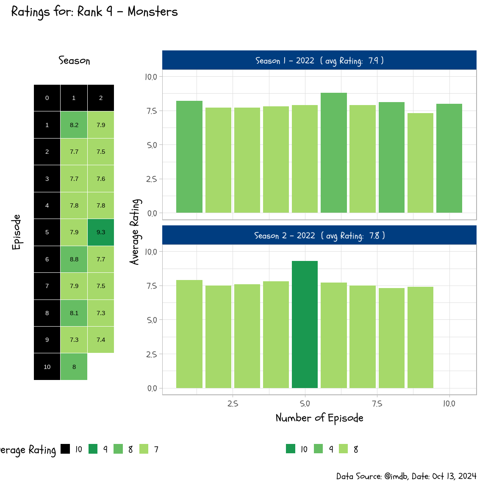
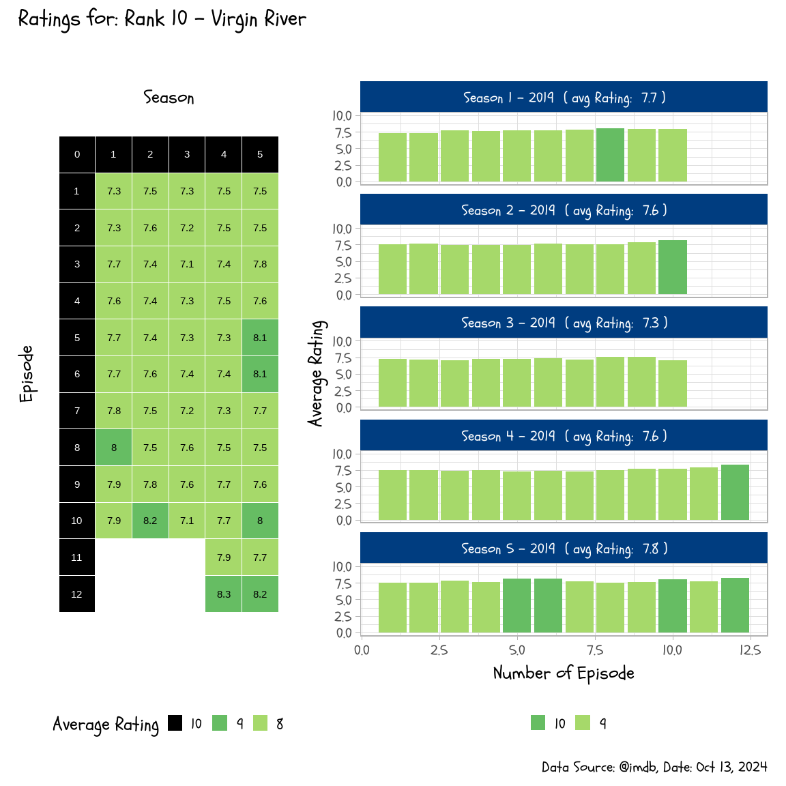

<!-- README.md is generated from README.Rmd. Please edit that file -->

# netflix_top10

<!-- badges: start -->
<!-- badges: end -->

The goal of netflix_top10 is to explore the top 10 netflix shows/movies
on regularily bases.

<!-- -->

# Combining with imDB

<!-- --><!-- -->

# Insprection of Perfromance of Top Shows on Netflix

<!-- --><!-- --><!-- --><!-- --><!-- --><!-- --><!-- --><!-- --><!-- --><!-- -->
