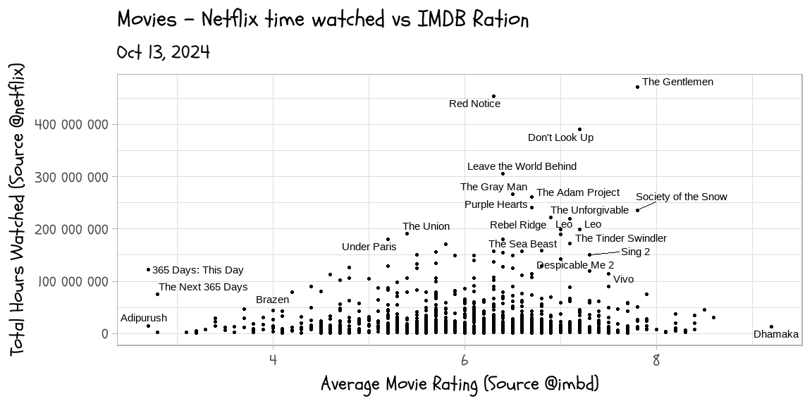
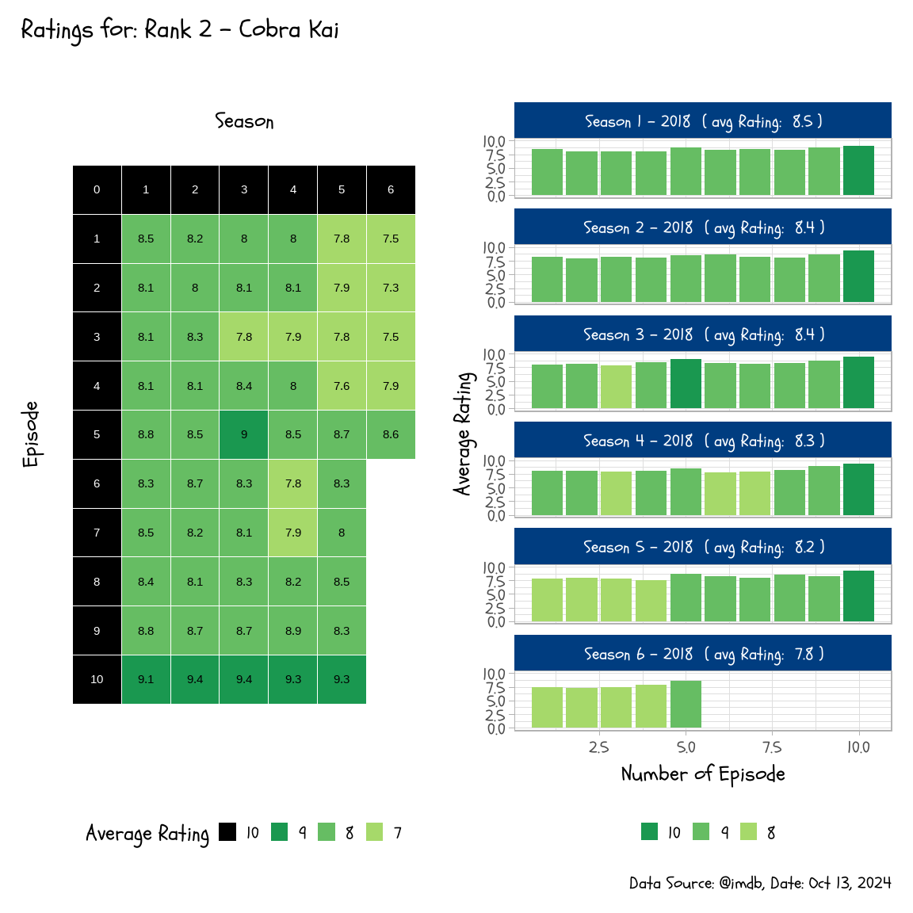
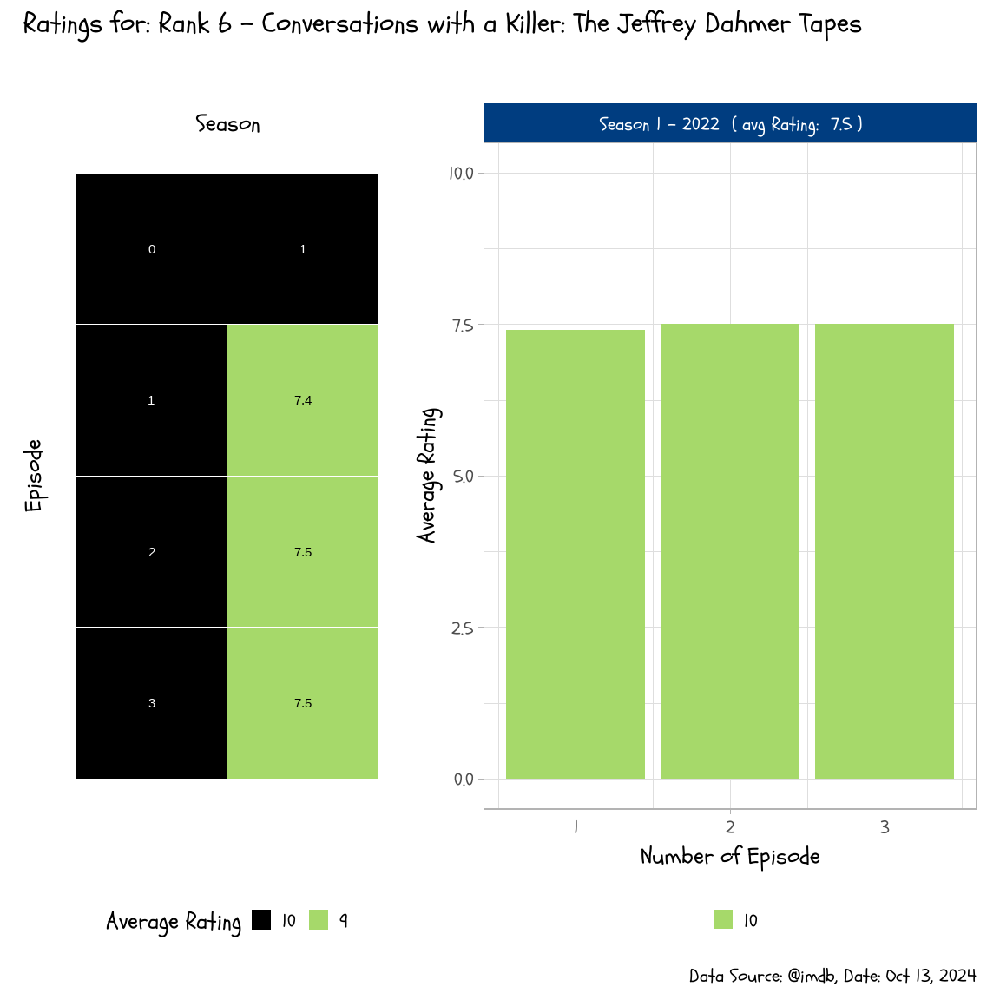

<!-- README.md is generated from README.Rmd. Please edit that file -->

# netflix_top10

<!-- badges: start -->
<!-- badges: end -->

The goal of netflix_top10 is to explore the top 10 netflix shows/movies
on regularily bases.

<!-- -->

# Combining with Netflix

<!-- --><!-- -->

# Insprection of Perfromance of Top Shows on Netflix

    #> [[1]]

<!-- -->

    #> 
    #> [[2]]

<!-- -->

    #> 
    #> [[3]]

<!-- -->

    #> 
    #> [[4]]

<!-- -->

    #> 
    #> [[5]]

<!-- -->

    #> 
    #> [[6]]

<!-- -->

    #> 
    #> [[7]]

<!-- -->

    #> 
    #> [[8]]

<!-- -->

    #> 
    #> [[9]]

<!-- -->

    #> 
    #> [[10]]

<!-- -->
